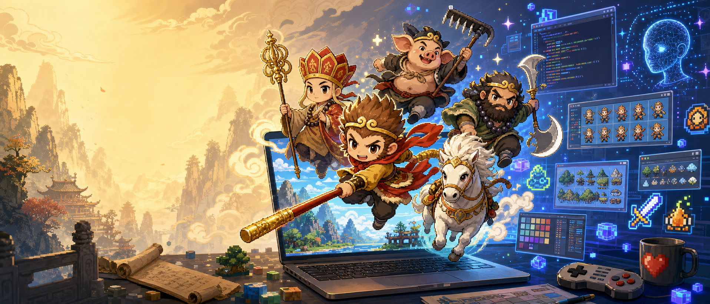

# 🐒 西天取经 — Journey to the West

> 西游记 × 吸血鬼幸存者，一款用 AI 驱动开发的独立游戏



## 🎮 在线试玩

**[👉 点击开始游戏](https://leisure3318.github.io/journey-to-the-west/)**

## 关于

「西天取经」是一款以《西游记》为主题的吸血鬼幸存者类游戏。操控唐僧，收服悟空、八戒、沙僧、白龙马四位徒弟，一路西行降妖伏魔。

本项目是「零基础用AI做游戏」公众号系列的实战产物，从游戏设计、图片生成到代码实现全程由 AI 辅助完成。

## 技术栈

| 技术 | 用途 |
|------|------|
| **Phaser 4 + TypeScript** | 游戏引擎 + 类型安全 |
| **Parcel 2** | 打包构建 |
| **Web Audio API** | 程序化音效（25种音效 + BGM，零外部音频文件） |
| **GPT Image 2** | 游戏图片资产生成（119张） |
| **Claude** | 全部代码编写 + 架构设计 |
| **GitHub Actions** | 自动部署到 GitHub Pages |

## 游戏特色

- 🐵 **师徒四人 + 白龙马**：各有独立 AI 状态机，自主战斗
- ⚔️ **23种升级 + 5个进化配方**：齐天大圣、万猴朝宗、食神、金身罗汉、通天神目
- 🐉 **4个大招**：齐天大圣 / 天蓬元帅 / 卷帘大将 / 龙太子化龙，平时蓄力 Boss 战自动释放
- 🎯 **唐僧主动技能**：紧箍咒（强化悟空）+ 大慈悲（全屏净化）
- 🏇 **白龙马剧情**：开局凡马 → 鹰愁涧收徒 → 白龙马化身 + 龙息尾迹
- 📦 **宝箱系统**：15种法器物品，3级掉落品质
- 🎵 **全程序化音效**：Web Audio API 生成 25 种音效 + 五声音阶 BGM
- 🗺️ **迷雾探索**：大地图 + 小地图 + 收徒 POI + 宝箱标记
- 👹 **3种 Boss**：黄风大王 / 白骨精 / 红孩儿，多阶段 AI

## 操作方式

| 按键 | 功能 |
|------|------|
| WASD / 方向键 | 移动 |
| 鼠标点击 | 移动到目标位置 |
| 1-9 | 使用物品栏对应物品 |
| M | 静音切换 |
| ESC | 暂停 / 恢复 |

## 本地开发

```bash
git clone https://github.com/leisure3318/journey-to-the-west.git
cd journey-to-the-west
npm install
npm run dev        # http://localhost:1234
```

构建：
```bash
npm run build      # 输出到 dist/
```

## 项目结构

```
src/
├── config/                     # 游戏配置
│   ├── GameConfig.ts           # 核心常量（世界3200×2400、玩家、经验）+ 统一re-export
│   ├── HeroConfig.ts           # 英雄属性 + AI参数（悟空/八戒/沙僧/白龙马）
│   ├── EnemyConfig.ts          # 敌人类型表 + 刷怪阶段（4阶段6种敌人）
│   ├── MapConfig.ts            # POI配置 + Boss类型表 + 地图生成
│   ├── EvolutionConfig.ts      # 5个技能进化配方
│   └── UpgradeConfig.ts        # 23个升级选项 + UpgradeState接口
├── entities/                   # 游戏实体
│   ├── Player.ts               # 唐僧：移动、HP、护盾、骑马、受伤飘字
│   ├── Disciple.ts             # 徒弟：三种攻击模式(arc/area/projectile)
│   ├── Boss.ts                 # Boss：多阶段AI(chase/charge/spin/rest)
│   └── Enemy.ts                # 敌人：追踪/远程/爆炸三种行为
├── systems/                    # 游戏系统（15+个）
│   ├── DiscipleManager.ts      # 徒弟协调层
│   ├── WukongAI.ts             # 悟空状态机：follow/engage/combat/return/guard
│   ├── BajieAI.ts              # 八戒状态机：follow/engage/combat/return/rest
│   ├── WujingAI.ts             # 沙僧状态机：follow/approach/combat/return
│   ├── CloneSystem.ts          # 悟空分身术
│   ├── UltimateSystem.ts       # 4个大招 + 独立冷却
│   ├── WujingAbilities.ts      # 沙僧被动：流沙陷阱/水幕天华/宝杖回旋
│   ├── TangsengSkills.ts       # 唐僧主动：紧箍咒 + 大慈悲
│   ├── DragonTrail.ts          # 白龙马龙息尾迹
│   ├── ChestSystem.ts          # 宝箱系统（15种物品，3tier掉落）
│   ├── SoundManager.ts         # 程序化音效（25种 + BGM，Web Audio API）
│   ├── EvolutionSystem.ts      # 技能进化检测 + 合成
│   ├── BossSystem.ts           # Boss生成/碰撞/击败
│   ├── CombatSystem.ts         # 投射物/伤害飘字/暴击/敌人血条
│   ├── EnemySpawner.ts         # 刷怪（4阶段密度递增）
│   ├── ExperienceSystem.ts     # 经验珠吸附 + 升级触发
│   ├── RecruitmentSystem.ts    # 收徒系统（POI触发）
│   ├── FogOfWar.ts             # 战争迷雾
│   ├── LandmarkSystem.ts       # 地标显示
│   └── DecorationSystem.ts     # 地图装饰物
├── ui/                         # UI组件
│   ├── HUD.ts                  # HP条/XP条/计时器/击杀数/波次
│   ├── LevelUpPanel.ts         # 升级3选1卡牌
│   ├── SkillBar.ts             # 左侧技能栏（按角色分组）
│   ├── ItemBar.ts              # 底部物品栏（固定9格）
│   ├── MiniMap.ts              # 右上角小地图
│   ├── BossHpBar.ts            # Boss血条
│   ├── PauseMenu.ts            # ESC暂停
│   ├── VictoryPanel.ts         # 通关画面
│   └── GameOverPanel.ts        # 游戏结束
├── scenes/                     # 场景
│   ├── BootScene.ts            # 资源加载 + 动画注册 + 程序化纹理
│   ├── MenuScene.ts            # 主菜单（山水画背景 + 师徒行走）
│   ├── CutsceneScene.ts        # 序幕CG（贞观十三年）
│   └── GameScene.ts            # 游戏主场景（纯协调层，~300行）
└── main.ts                     # Phaser启动入口

assets/
├── sprites/heroes/sliced_v3/   # 英雄切图（128×128帧，4方向×5动作）
├── sprites/enemies/common/     # 30种普通小怪（192px）
├── sprites/enemies/bosses/     # 28个Boss（384px）
├── portraits/                  # 角色肖像
├── skills/vfx/                 # 20张技能特效（256px）
├── skills/icons/               # 19张技能图标（128px）
├── skills/items/               # 15张法器图标（128px）
├── cutscenes/                  # 4张序幕CG（960px）
├── menu_bg.png                 # 首页山水画（960px）
└── series/cover.png            # 公众号封面图

scripts/
├── generate_image.py           # 单张图片生成（调用GPT Image 2 API）
├── generate_all_skills.py      # 批量生成52张技能图片
├── generate_all_enemies.py     # 批量生成58张敌人图片
├── generate_prologue_cg.py     # 生成4张序幕CG
├── generate_riding_sprite.py   # 生成骑马唐僧sprite
├── generate_remaining_cg.py    # 生成剩余CG
├── slice_sprites_v3.py         # sprite sheet自动切图
└── optimize_assets.sh          # 图片批量压缩（270MB→15MB）

docs/
├── GAME_DESIGN.md              # 游戏设计文档（81关、角色、Boss）
├── SKILL_SYSTEM.md             # 技能系统（20技能+进化+15法器）
├── ENEMY_DESIGN.md             # 妖怪设计（30小怪+28Boss+数值公式）
├── CHEST_SYSTEM.md             # 宝箱系统设计
├── STORY_SYSTEM.md             # 剧情系统设计
└── articles/                   # 公众号系列文章原稿
```

## 图片生成

所有 119 张游戏图片由 GPT Image 2 生成。以下是部分提示词示例：

**英雄 sprite sheet（悟空）：**
> Chibi/cute-but-menacing top-down 2D game hero sprite sheet. Sun Wukong (Monkey King) in golden armor with red cape, holding golden iron staff, large head small body proportions. 4 rows × 5 columns grid: Row 1 facing down, Row 2 facing right, Row 3 facing up, Row 4 facing left. Each row: idle pose + 4 walking frames. Soft cel-shaded, warm color palette, clean outlines. Transparent background (PNG).

**敌人（通用风格锚定）：**
> ENEMY STYLE ANCHOR: Chibi/cute-but-menacing top-down 2D game enemy sprite, matching the art style of the hero characters — soft cel-shaded, warm color palette with darker tones for enemies, clean outlines, large head small body proportions. Single character centered on transparent background (PNG).

**技能VFX（齐天大圣变身）：**
> Top-down 2D game VFX sprite, Great Sage Equal to Heaven ultimate effect. A massive golden iron staff expanding and shrinking rapidly, leaving afterimages in a full 360-degree spin, surrounded by golden cloud explosion and celestial Chinese characters glowing in the air. Transparent background (PNG), cel-shaded style, epic gold and crimson palette, clean outlines.

**法器图标（通用模板）：**
> 2D game item icon, {name} from Journey to the West. {desc}. Centered on transparent background, detailed but clean cel-shaded style, golden border frame with subtle Buddhist motif, warm lighting, suitable for game UI inventory slot. 256x256 pixels.

**序幕CG（贞观大殿）：**
> Cinematic game cutscene illustration, ancient Tang Dynasty imperial court hall. Emperor Taizong of Tang sits on a golden dragon throne at the center, wearing imperial yellow dragon robes and a black mianguan crown. Young Buddhist monk Xuanzang kneels before the throne, holding a golden travel permit scroll. Rows of court officials in colorful silk robes stand on both sides. Grand red pillars, golden ceiling with dragon carvings, incense smoke drifting. Chinese ink wash painting meets modern game concept art style.

生成脚本需要配置环境变量：
```bash
export OPENAI_API_KEY="your-api-key"
export IMAGE_API_BASE="your-api-base-url"

# 生成所有技能图片（52张）
python scripts/generate_all_skills.py

# 生成所有敌人图片（58张）
python scripts/generate_all_enemies.py

# 生成序幕CG（4张）
python scripts/generate_prologue_cg.py

# sprite sheet切图（自动检测坏帧并替换）
python scripts/slice_sprites_v3.py

# 图片压缩（270MB→15MB）
bash scripts/optimize_assets.sh
```

## 公众号系列

本项目配套「零基础用AI做游戏」系列文章，记录从零开始的完整开发过程：

| 天数 | 标题 | 链接 |
|------|------|------|
| Day 1 | 从零开始，一天搞出100多张图 | [阅读](https://mp.weixin.qq.com/s/JsK1kH8ZldzvwnIEKJ0img) |
| Day 2 | 一天写出完整的吸血鬼幸存者核心玩法 | [阅读](https://mp.weixin.qq.com/s/ioHKVoApHQ5Sw0XPwmy_yQ) |
| Day 3 | Boss战、序幕CG、收徒系统全部上线 | [阅读](https://mp.weixin.qq.com/s/u7oEc-UwhQqhKut3jG1MQw) |
| Day 4 | AI状态机、技能进化、暴击系统、代码重构 | [阅读](https://mp.weixin.qq.com/s/L0tWptd4UbL9IBervWoc2A) |
| Day 5 | 程序化音效、宝箱法器、白龙马剧情重做 | 待发布 |

## License

MIT
